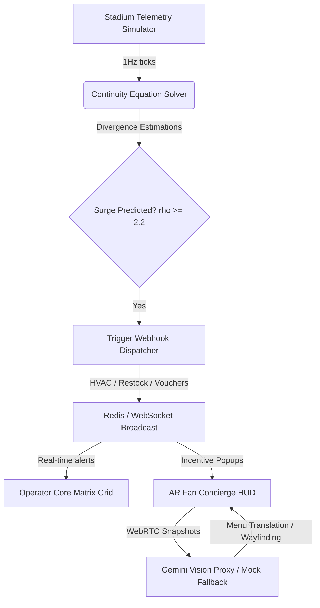

# The FIFA Nexus Matrix

**A Bipartite Asynchronous Mesh for Stadium Operations and Fan Experience**

Built for the high-stakes hackathon, **The FIFA Nexus Matrix** integrates macroscopic crowd fluid simulation, real-time predictive operator monitoring, and immersive fan WebAR assistance. It detects corridor bottlenecks 15 minutes before they manifest and dynamically routes fans to under-utilized stadium zones using WebAR-based directional indicators and concession discount incentives.

---

## 🏗 System Architecture

The application is structured as a monorepo consisting of:
1. **The Predictive Operator Core (Backend)**: Built with Python (FastAPI). It simulates zone-by-zone crowd movements, computes fluid divergence, predicts potential surges, and broadcasts live telemetry.
2. **The AR Fan Concierge (Frontend)**: Built with React, TypeScript, and Vite. It connects to the backend over WebSockets, renders live operator metrics, captures camera frames, and overlays transparent Three.js WebGL direction arrows.



---

## 🧮 Mathematical Modeling

### 1. Macroscopic Crowd Fluid Dynamics
Crowd movement is modeled macroscopically as a compressible fluid following the continuity equation:

$$\frac{\partial \rho}{\partial t} + \nabla \cdot (\rho \mathbf{v}) = 0$$

Where:
- $\rho$ is the crowd density ($\text{pax/m}^2$).
- $\mathbf{v} = (v_x, v_y)$ is the velocity flow vector ($\text{m/s}$).

### 2. Lighthill-Whitham-Richards (LWR) Velocity Decay
To prevent unphysical density spikes, the solver implements the LWR crowd dynamics feedback loop:

$$v_{damped} = v \cdot \max\left(0, 1 - \frac{\rho}{\rho_{jam}}\right)$$

Where the critical jam density $\rho_{jam}$ is set to $4.5 \text{ pax/m}^2$. As corridors reach capacity, fan movement slows down, dampening further density buildup.

### 3. Spatial Divergence Estimation
The spatial derivatives are approximated using zone neighbors at a physical grid scale of 80 meters:

$$\text{div}(\mathbf{v}) \approx \frac{\Delta v_x}{\Delta x} + \frac{\Delta v_y}{\Delta y}$$

---

## 🚀 Getting Started

### Prerequisites
- Node.js (v18+)
- `pnpm` (v10+)
- Python 3.10+

### Installation & Run

#### 1. Start the Backend
Navigate to the `/backend` directory, install packages, and start the Uvicorn web server:
```bash
cd backend
pip install -r requirements.txt
python3 -m uvicorn app.main:app --port 8000 --reload
```
The server will run on `http://localhost:8000`.

#### 2. Start the Frontend
Navigate to the `/frontend` directory, install dependencies via `pnpm`, and run the Vite compiler:
```bash
cd frontend
pnpm install
pnpm dev
```
The client dashboard will compile and host on `http://localhost:3000`.

---

## ⚡ Mock & Demo Instructions

The system includes helper routines to demonstrate the real-time closed-loop pipeline instantly:
- **Automatic Simulation Surge**: A simulated surge starts in zone `C3` at $t=60\text{s}$ (peaking at $2.8\text{ pax/m}^2$ at $t=120\text{s}$), triggering automatic voucher broadcasts.
- **Manual Demo Surge**: Click **"⚡ Trigger Demo Surge"** in the top-right header on the dashboard to immediately inject a critical warning alert into the WebSocket stream.
- **Voucher Routing**: Click **"Navigate Now"** on the voucher modal to point the WebGL Three.js arrow overlay towards the recommended diversion zone.
