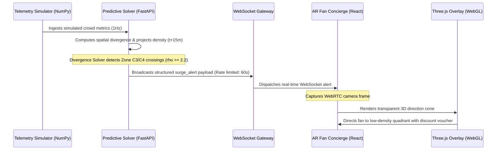

# The FIFA Nexus Matrix

### Smart Stadium Crowd Safety & Event Egress Management (FIFA World Cup 2026 Vertical)

The **FIFA Nexus Matrix** is a closed-loop Bipartite Asynchronous Mesh engineered to solve high-density crowd bottlenecks during large-scale stadium events. By combining macroscopic fluid dynamics predictions on the backend with real-time WebAR overlays on the frontend, the system forecasts congestion points 15 minutes before they manifest and dynamically redistributes fan flows using automated concession incentives.

---

## 🎯 FIFA World Cup 2026 Challenge Alignment (Challenge 04)

### 1. Problem Statement
During the FIFA World Cup 2026, hosting millions of fans across transit hubs, concourses, and stadiums (such as MetLife Stadium) presents massive crowd safety and operations challenges. High crowd densities lead to physical bottlenecks, increased safety risks, long queue wait times at concession stands, and localized HVAC stress. 

The FIFA Nexus Matrix directly addresses **Challenge 04: Stadium Operations Optimization & Fan Experience Enhancement**.

### 2. How It Solves Both Halves
*   **Stadium Operations Optimization (Backend)**: 
    *   **Macroscopic Predictive Fluid Dynamics**: Forecasts localized crowd surges 15 minutes in advance using real-time density-velocity field divergence computations.
    *   **Automated Closed-Loop Adjustments**: Automatically dispatches triggers to lower HVAC temperature thresholds in high-density zones to counteract metabolic heat loads and fires concessions restock tasks (e.g., water, drinks).
*   **Fan Experience Enhancement (Frontend)**:
    *   **Interactive WebAR HUD**: Empowers fans with mobile-first WebAR navigation, local menu translation using Google Gemini Multimodal APIs, and in-seat food delivery checking.
    *   **Voucher Incentive Loops**: Renders dynamic discount vouchers to fans in surge zones, incentivizing them to move to under-utilized stadium zones and reducing bottlenecks.

### 3. Operations ↔ Fan Experience Bridge
The system operates as a **closed-loop feedback cycle**:
1. **Detect**: The backend fluid solver detects a density spike (e.g., $\ge 2.2 \text{ pax/m}^2$ in Zone C3).
2. **Dispatch**: It automatically triggers localized operations (HVAC cooling, restocking concession stands) *and* constructs a dynamic fan voucher.
3. **Broadcast**: A `surge_alert` is broadcasted via WebSockets to all connected fan clients.
4. **Incentivize**: The fan's AR HUD renders a modal offering a 20% discount if they navigate to an under-utilized zone (e.g., A1).
5. **Route**: When the fan clicks "Navigate", the WebGL overlay draws a 3D arrow guiding them away from the bottleneck.
6. **Resolve**: As fans disperse, the local density drops, the solver stabilizes, and the operations loop closes flawlessly.

### 4. Key Differentiators vs Simple Chatbots/Dashboards
*   **Active vs Passive**: Rather than passively displaying crowd status, the system closes the loop by routing fans dynamically using financial incentives and WebAR guides.
*   **Mathematical Forecasting**: Extrapolates crowd trends using physics-based mass conservation (continuity equation + LWR speed decay) instead of static thresholding.

### 4. Mathematical Innovation
Instead of purely statistical models, the backend models the crowd as a compressible fluid:
*   **Crowd Conservation (Continuity Equation)**: Ensures that people are neither created nor destroyed during walking transitions, tracking density fluxes between adjacent stadium zones.
*   **LWR Density Damping**: Factors in the physical limits of human walking speeds (velocity decays to 0 as density reaches $4.5 \text{ pax/m}^2$).

---

## ♿ Social Good & Accessibility Impact

The **Aura Module** introduces real-time crowd safety, step-free routing, and medical priority triggers designed to ensure stadium environments are inclusive and safe for all fans:

*   **Step-Free & Accessible Routing**: When *Accessibility Mode* is activated on the fan's WebAR HUD, the routing calculations automatically query routes that avoid stairs, escalators, and steep grade changes, utilizing ramps and elevators instead. The routing request appends `&inclusive=true` to fetch specialized routes.
*   **Sensory-Friendly Crowd Avoidance**: Fans with sensory sensitivities or anxiety can request alternative egress routes that explicitly bypass high-decibel zones, congested concession queues, and high-density zones, directing them through calmer corridor vectors.
*   **Instant Medical Egress & SOS Triage**: In the event of a medical emergency, clicking the high-contrast *SOS Medical* button dispatches a priority POST request to `/api/emergency`. This bypasses default simulations and triggers a `MEDICAL_OVERRIDE` event, flashing the affected sector blue on the Operator Dashboard for instant dispatcher attention.

---


## 🚀 Live Production Links

> [!IMPORTANT]
> Use the following public endpoints to inspect and interact with the deployed live environments:

*   **Frontend (Web Client)**: [https://fifa-nexus-matrix.vercel.app](https://fifa-nexus-matrix.vercel.app)
*   **Backend (Predictive Solver Core)**: [https://fifa-nexusmatrix.onrender.com](https://fifa-nexusmatrix.onrender.com)
*   **Real-Time Gateway Stream**: `wss://fifa-nexusmatrix.onrender.com/ws/ops`

---

## 🧮 Mathematical Modeling

### 1. Macroscopic Crowd Continuity Equation
Crowd flow is modeled as a compressible fluid where the density conservation law is dictated by:

$$\frac{\partial \rho}{\partial t} + \nabla \cdot (\rho \mathbf{v}) = 0$$

Where:
*   $\rho(x, y, t)$ represents the local crowd density in $\text{pax/m}^2$.
*   $\mathbf{v}(x, y, t) = (v_x, v_y)$ is the velocity vector of the crowd flow in $\text{m/s}$.
*   $\nabla \cdot (\rho \mathbf{v})$ is the spatial divergence of the mass flux.

### 2. Lighthill-Whitham-Richards (LWR) Velocity Decay
To model realistic crowd behavior, velocity is damped as a function of current local density. In high-density regions, walking speeds decay linearly towards a physical jam density:

$$\mathbf{v}_{damped} = \mathbf{v} \cdot \max\left(0, 1 - \frac{\rho}{\rho_{jam}}\right)$$

We define critical jam density $\rho_{jam} = 4.5 \text{ pax/m}^2$.

### 3. Finite-Difference Spatial Divergence
Divergence calculations use a finite-difference spatial grid based on adjacent quadrants spaced at an 80-meter physical interval:

$$\text{div}(\mathbf{v}) \approx \frac{\Delta v_x}{\Delta x} + \frac{\Delta v_y}{\Delta y}$$

---

## 🔄 Closed-Loop Engineering Architecture

The platform functions as a bipartite mesh executing a continuous feedback loop:



1. **Ingest & Predict**: Live stadium sensors stream density and velocity fields to the FastAPI backend.
2. **Flag & Broadcast**: The NumPy fluid solver extrapolates density 15 minutes out. If predicted density is projected to cross $\ge 2.2 \text{ pax/m}^2$ (Zone C3/C4), a high-priority warning trigger is published.
3. **Notify & Dynamic Route**: The client captures the broadcast, presenting fans with an overlay modal offering dynamic discount vouchers. Clicking "Navigate Now" feeds routing angles into the WebGL camera viewfinder.

---

## 🛠 Local Verification Run

Follow these guidelines to spin up the system locally for inspection:

### 1. Prerequisite Infrastructure
Ensure Docker is installed to spin up the local Redis queue:
```bash
docker compose up -d
```

### 2. Launch the Backend Server
Initialize the Python virtual environment and start Uvicorn:
```bash
cd backend
pip install -r requirements.txt
python3 -m uvicorn app.main:app --port 8000 --reload
```

### 3. Compile the Frontend
Install local dependencies and launch Vite:
```bash
cd ../frontend
pnpm install
pnpm dev
```
Open your browser and navigate to `http://localhost:3000`.

### 4. Running the Test Suites
The system includes comprehensive test coverage for both backend (Python) and frontend (React/TypeScript).

**Backend (pytest):**
```bash
cd backend
source .venv/bin/activate
pytest -v
```

**Frontend (vitest):**
```bash
cd frontend
npx vitest run
```

---

## 🔒 Security & Build Compliance

All local environment variables and secrets are completely isolated from active Git tracking:
- `backend/.env` is ignored via `.gitignore`
- `frontend/.env.local` is ignored via `.gitignore`

### Finalized Project File Tree
```
FIFA_NexusMatrix/
├── .gitignore
├── README.md
├── docker-compose.yml
├── backend/
│   ├── app/
│   │   ├── models/
│   │   │   └── schemas.py
│   │   ├── routers/
│   │   │   ├── vision.py
│   │   │   └── ws_ops.py
│   │   ├── services/
│   │   │   ├── fluid_solver.py
│   │   │   ├── redis_pubsub.py
│   │   │   └── telemetry_sim.py
│   │   ├── webhooks/
│   │   │   └── triggers.py
│   │   ├── __init__.py
│   │   └── main.py
│   ├── tests/
│   │   ├── conftest.py
│   │   ├── test_fluid_solver.py
│   │   ├── test_schemas.py
│   │   ├── test_telemetry_sim.py
│   │   ├── test_triggers.py
│   │   ├── test_vision_router.py
│   │   ├── test_ws_ops.py
│   │   └── __init__.py
│   ├── requirements.txt
│   └── .env (Excluded from Git Tracking)
└── frontend/
    ├── package.json
    ├── pnpm-lock.yaml
    ├── pnpm-workspace.yaml
    ├── tsconfig.json
    ├── vite.config.ts
    ├── vitest.config.ts
    ├── index.html
    └── src/
        ├── App.tsx
        ├── main.tsx
        ├── vite-env.d.ts
        ├── config.ts
        ├── __tests__/
        │   ├── App.test.tsx
        │   ├── OperatorDashboard.test.tsx
        │   ├── SurgeModal.test.tsx
        │   └── setup.ts
        ├── components/
        │   ├── ARConcierge.tsx
        │   ├── CameraErrorBoundary.tsx
        │   ├── OperatorDashboard.tsx
        │   ├── SurgeModal.tsx
        │   └── WayfindingOverlay.tsx
        ├── hooks/
        │   ├── useCamera.ts
        │   └── useWebSocket.ts
        └── styles/
            └── globals.css
```
