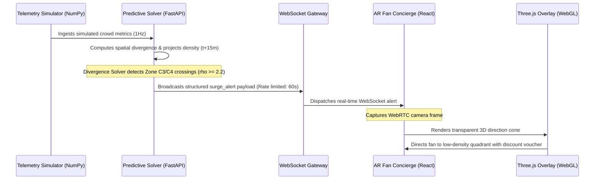

# The FIFA Nexus Matrix

### Smart Stadium Crowd Safety & Event Egress Management (FIFA World Cup 2026 Vertical)

The **FIFA Nexus Matrix** is a closed-loop Bipartite Asynchronous Mesh engineered to solve high-density crowd bottlenecks during large-scale stadium events. By combining macroscopic fluid dynamics predictions on the backend with real-time WebAR overlays on the frontend, the system forecasts congestion points 15 minutes before they manifest and dynamically redistributes fan flows using automated concession incentives.

---

## 🚀 Live Production Links

> [!IMPORTANT]
> Use the following public endpoints to inspect and interact with the deployed live environments:

*   **Frontend (Web Client)**: [https://fifa-nexus-matrix.vercel.app](https://fifa-nexus-matrix.vercel.app)
*   **Backend (Predictive Solver Core)**: [https://fifa-nexusmatrix.onrender.com](https://fifa-nexusmatrix.onrender.com)
*   **Real-Time Gateway Stream**: `wss://fifa-nexusmatrix.onrender.com/ws/ops`

---

## 🧮 Mathematical Modeling

### 1. Macroscopic Crowd Continuity Equation
Crowd flow is modeled as a compressible fluid where the density conservation law is dictated by:

$$\frac{\partial \rho}{\partial t} + \nabla \cdot (\rho \mathbf{v}) = 0$$

Where:
*   $\rho(x, y, t)$ represents the local crowd density in $\text{pax/m}^2$.
*   $\mathbf{v}(x, y, t) = (v_x, v_y)$ is the velocity vector of the crowd flow in $\text{m/s}$.
*   $\nabla \cdot (\rho \mathbf{v})$ is the spatial divergence of the mass flux.

### 2. Lighthill-Whitham-Richards (LWR) Velocity Decay
To model realistic crowd behavior, velocity is damped as a function of current local density. In high-density regions, walking speeds decay linearly towards a physical jam density:

$$\mathbf{v}_{damped} = \mathbf{v} \cdot \max\left(0, 1 - \frac{\rho}{\rho_{jam}}\right)$$

We define critical jam density $\rho_{jam} = 4.5 \text{ pax/m}^2$.

### 3. Finite-Difference Spatial Divergence
Divergence calculations use a finite-difference spatial grid based on adjacent quadrants spaced at an 80-meter physical interval:

$$\text{div}(\mathbf{v}) \approx \frac{\Delta v_x}{\Delta x} + \frac{\Delta v_y}{\Delta y}$$

---

## 🔄 Closed-Loop Engineering Architecture

The platform functions as a bipartite mesh executing a continuous feedback loop:



1. **Ingest & Predict**: Live stadium sensors stream density and velocity fields to the FastAPI backend.
2. **Flag & Broadcast**: The NumPy fluid solver extrapolates density 15 minutes out. If predicted density is projected to cross $\ge 2.2 \text{ pax/m}^2$ (Zone C3/C4), a high-priority warning trigger is published.
3. **Notify & Dynamic Route**: The client captures the broadcast, presenting fans with an overlay modal offering dynamic discount vouchers. Clicking "Navigate Now" feeds routing angles into the WebGL camera viewfinder.

---

## 🛠 Local Verification Run

Follow these guidelines to spin up the system locally for inspection:

### 1. Prerequisite Infrastructure
Ensure Docker is installed to spin up the local Redis queue:
```bash
docker compose up -d
```

### 2. Launch the Backend Server
Initialize the Python virtual environment and start Uvicorn:
```bash
cd backend
pip install -r requirements.txt
python3 -m uvicorn app.main:app --port 8000 --reload
```

### 3. Compile the Frontend
Install local dependencies and launch Vite:
```bash
cd ../frontend
pnpm install
pnpm dev
```
Open your browser and navigate to `http://localhost:3000`.

---

## 🔒 Security & Build Compliance

All local environment variables and secrets are completely isolated from active Git tracking:
- `backend/.env` is ignored via `.gitignore`
- `frontend/.env.local` is ignored via `.gitignore`

### Finalized Project File Tree
```
FIFA_NexusMatrix/
├── .gitignore
├── README.md
├── docker-compose.yml
├── nexus_overview.md
├── backend/
│   ├── app/
│   │   ├── models/
│   │   │   └── schemas.py
│   │   ├── routers/
│   │   │   ├── vision.py
│   │   │   └── ws_ops.py
│   │   ├── services/
│   │   │   ├── fluid_solver.py
│   │   │   ├── redis_pubsub.py
│   │   │   └── telemetry_sim.py
│   │   ├── webhooks/
│   │   │   └── triggers.py
│   │   ├── __init__.py
│   │   └── main.py
│   ├── requirements.txt
│   └── .env (Excluded from Git Tracking)
└── frontend/
    ├── package.json
    ├── pnpm-lock.yaml
    ├── tsconfig.json
    ├── vite.config.ts
    ├── index.html
    └── src/
        ├── App.tsx
        ├── main.tsx
        ├── vite-env.d.ts
        ├── components/
        │   ├── ARConcierge.tsx
        │   ├── OperatorDashboard.tsx
        │   ├── SurgeModal.tsx
        │   └── WayfindingOverlay.tsx
        ├── hooks/
        │   ├── useCamera.ts
        │   └── useWebSocket.ts
        └── styles/
            └── globals.css
```
